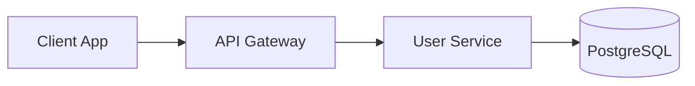

# API SPEC: User Management Service v2

This document outlines the proposed design for the **User Management Service** rewrite, replacing the legacy monolith with focused REST endpoints backed by PostgreSQL.

## Architecture Overview

All requests flow through the API Gateway, which handles auth and rate limiting. The service is stateless and horizontally scalable.



## Create User

The `POST /users` endpoint accepts a JSON body and returns the created resource:

```typescript
interface CreateUserRequest {
  email: string;
  displayName: string;
  role: "admin" | "editor" | "viewer";
}

async function createUser(req: CreateUserRequest): Promise<User> {
  const existing = await db.users.findByEmail(req.email);
  if (existing) throw new ConflictError("email already registered");
  return db.users.insert({ ...req, createdAt: new Date() });
}
```

```question:choice
id: q-auth-strategy
question: Which authentication strategy should the gateway use?
options: JWT with short-lived tokens | OAuth 2.0 + opaque tokens | API key per client | Session cookies
```

## Rate Limiting

Requests are throttled using a sliding-window algorithm. Defaults are **100 requests per minute** per API key, configurable per tier.

> **Note:** Burst allowances may be granted to internal services on a case-by-case basis. Contact the platform team.
