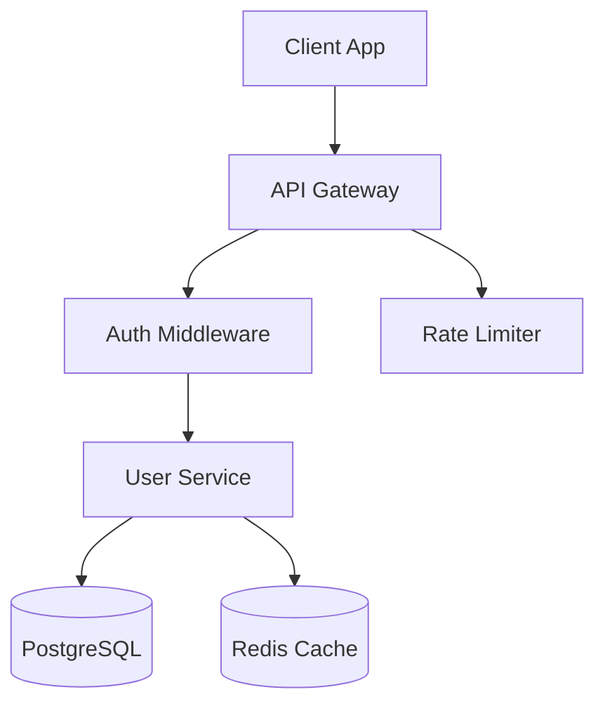

# API SPEC: User Management Service v2

This document outlines the proposed design for the **User Management Service** rewrite. The new service replaces the legacy monolith with a set of focused REST endpoints backed by a PostgreSQL datastore.

## Architecture Overview

All requests flow through the API Gateway, which handles authentication, rate limiting, and request routing. The service itself is stateless and horizontally scalable behind a load balancer.



## Core Endpoints

The following table summarizes the primary endpoints:

| Method | Path              | Description          |
| ------ | ----------------- | -------------------- |
| GET    | `/users`          | List users (paginated) |
| POST   | `/users`          | Create a new user    |
| GET    | `/users/:id`      | Fetch user by ID     |
| PATCH  | `/users/:id`      | Update user fields   |
| DELETE | `/users/:id`      | Soft-delete a user   |

### Create User

The `POST /users` endpoint accepts a JSON body and returns the created resource. Input is validated against the schema below.

```typescript
interface CreateUserRequest {
  email: string;
  displayName: string;
  role: "admin" | "editor" | "viewer";
  metadata?: Record<string, unknown>;
}

async function createUser(req: CreateUserRequest): Promise<User> {
  const existing = await db.users.findByEmail(req.email);
  if (existing) {
    throw new ConflictError("email already registered");
  }
  return db.users.insert({ ...req, createdAt: new Date() });
}
```

All error responses follow the standard `{ code, message, details }` envelope defined in the shared error module.

```question:choice
id: q-auth-strategy
question: Which authentication strategy should the gateway use?
options: JWT with short-lived tokens | OAuth 2.0 + opaque tokens | API key per client | Session cookies
```

## Rate Limiting

Requests are throttled at the gateway level using a sliding-window algorithm. Defaults are **100 requests per minute** per API key, configurable per tier.

> **Note:** Burst allowances may be granted to internal services on a case-by-case basis. Contact the platform team for details.

- Rate limit headers (`X-RateLimit-Remaining`, `X-RateLimit-Reset`) are included in every response.
- Exceeding the limit returns `429 Too Many Requests` with a `Retry-After` header.
- Authenticated admin endpoints have a separate, higher limit pool.
