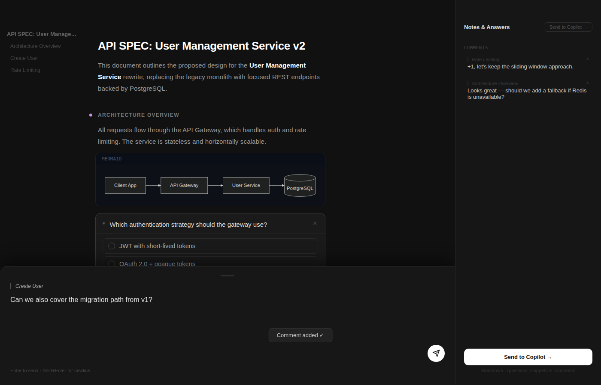

<p align="center">
  
</p>

<h1 align="center">markdown-review</h1>

<p align="center">
  <a href="https://www.npmjs.com/package/markdown-review"></a>
  <a href="https://github.com/rwoll/markdown-review/blob/main/LICENSE"></a>
</p>

<p align="center">
  <strong>Interactive markdown plan review UI — annotate sections, answer AI-agent embedded questions, and export structured feedback.</strong>
</p>

---

## Screenshot



---

`markdown-review` is a zero-install CLI that opens a local browser UI for
reviewing markdown plans. It is part of the
[markdown-review](https://github.com/rwoll/markdown-review) monorepo.

## Quick Start

```bash
npx markdown-review PLAN.md              # review in browser, feedback to stdout
npx markdown-review PLAN.md -o fb.md     # write feedback to file
npx markdown-review PLAN.md --json       # JSON output instead of markdown
```

## Features

- **Document rendering** — headings, paragraphs, lists, blockquotes, syntax-highlighted code, and mermaid diagrams
- **Embedded AI questions** — open-text, single-choice, and multi-checkbox
- **Inline annotations** — click any block to leave a comment
- **General feedback** — start typing anywhere to open the comment sheet
- **Export** — structured feedback as markdown or JSON
- **Dark theme** — high-contrast, reading-optimised

## Embedding Questions

Use fenced code blocks with a `question:` language tag so reviewers can answer
directly in the UI:

````markdown
```question:open
id: q-approach
question: What do you think about this approach?
```

```question:choice
id: q-preference
question: Which option do you prefer?
options: Option A | Option B | Option C
```

```question:checkbox
id: q-features
question: Select all that apply
options: Feature 1 | Feature 2 | Feature 3
```
````

## 🚀 Using GitHub Copilot CLI? Install the Plugin!

If you use [GitHub Copilot in the terminal](https://docs.github.com/en/copilot/how-tos/copilot-cli),
install the **review** plugin and Copilot will automatically open plans for
review — no manual `npx` needed:

```bash
copilot plugin install rwoll/markdown-review:packages/copilot-plugin
```

Once installed, Copilot writes a plan → opens the review UI in your browser →
waits for your feedback → incorporates it and continues. The whole loop happens
without leaving the terminal.

```bash
copilot plugin list                        # view installed plugins
copilot plugin update markdown-review      # update to latest
copilot plugin uninstall markdown-review   # remove
```

## 🧩 VS Code Extension

Prefer to stay in your editor? Install the
[Plan Review extension](https://marketplace.visualstudio.com/items?itemName=rwoll.markdown-review)
to review markdown plans directly inside VS Code — feedback is forwarded
straight to Copilot chat.

```
ext install rwoll.markdown-review
```

## License

[MIT](https://github.com/rwoll/markdown-review/blob/main/LICENSE)
